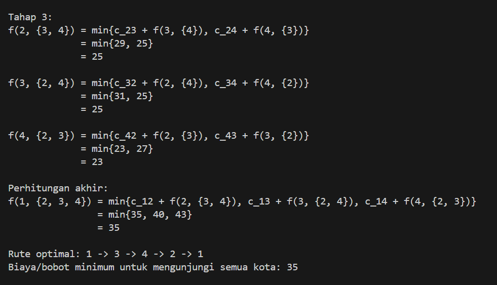

# Traveling Salesman Problem Solver (Dynamic Programming)
Program ini menyelesaikan permasalahan **Travelling Salesman Problem (TSP)** menggunakan pendekatan **Dynamic Programming** dalam bahasa **Ruby**.

---

## Cara Kerja Program

TSP (Travelling Salesman Problem) adalah masalah pencarian rute minimum untuk mengunjungi setiap kota sekali saja, lalu kembali ke kota asal. Program ini menyelesaikan TSP menggunakan pendekatan **Dynamic Programming Bottom-Up**.

Langkah-langkah utama program:

- Membuat fungsi `tsp_program(distance)` yang menerima matriks jarak antar kota sebagai input.
- Menggunakan **bitmasking** untuk merepresentasikan kombinasi subset kota yang telah dikunjungi.
- Menyusun tabel `dp[i][mask]`, di mana:
  - `i` adalah kota terakhir yang dikunjungi,
  - `mask` adalah subset kota yang telah dikunjungi,
  - `dp[i][mask]` menyimpan jarak minimum dari kota awal ke `i` sambil mengunjungi semua kota dalam `mask`, lalu kembali ke asal.
- Mengisi `dp` secara bertingkat, mulai dari subset kecil hingga semua kota (urutan sesuai tahap di slide).
- Setelah selesai, program akan menentukan rute optimal dengan menelusuri kembali (backtrack) jalur dari kota akhir ke kota awal.
- Program mencetak perhitungan tiap tahap, seperti `f(i, S)`, lengkap dengan rute optimal dan bobot minimal.

---

## Cara Menjalankan

1. **Install Ruby** (jika belum):
   - Windows: [https://rubyinstaller.org/](https://rubyinstaller.org/)
   - Cek instalasi:
     ```bash
     ruby -v
     ```

2. **Jalankan program** dari root direktori proyek:
    ```bash
    ruby src/main.rb
    ```
- Jika ingin memasukkan input dari file (pada folder test), gunakan:
    ```bash
    ruby src/main.rb < test/input.txt
    ```

3. **Masukkan input sesuai instruksi**, contoh:
    ```
    Masukkan jumlah kota:
    4
    Masukkan matriks jarak antar kota (pisahkan dengan spasi):
    0 10 15 20
    10 0 35 25
    15 35 0 30
    20 25 30 0
    ```

## Ilustrasi Proses
Berikut adalah hasil output dari program yang menunjukkan langkah-langkah penyelesaian TSP:


